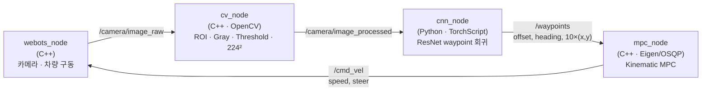

# 🚗 Camera-only Autopilot — Webots × ROS 2 × CNN × MPC

**카메라 한 대만으로 차선을 유지하는 자율주행 파이프라인.**
Webots 시뮬레이터의 전방 카메라 영상을 OpenCV로 전처리하고, CNN이 차선 기반 waypoint를 회귀한 뒤, OSQP로 푸는 **Kinematic MPC**가 조향·가속을 계산합니다. 모든 모듈은 ROS 2 노드로 분리되어 토픽으로 연결됩니다.

> 숭실대학교 AI소프트웨어학부 · 2026-1 고급프로그래밍(C++) 팀 프로젝트 (2026.03 ~ 2026.06)

<p>


</p>

---

## Architecture



| 노드 | 입력 → 출력 | 핵심 |
|---|---|---|
| `webots_node` | `/cmd_vel` → `/camera/image_raw` | Webots 카메라 프레임을 ROS 이미지로 발행, 조향/구동 모터 제어 (조향 ±0.42 rad 제한) |
| `cv_node` | `image_raw` → `image_processed` | 하단 ½ ROI → 그레이스케일 → 이진화(>200) → 224×224 리사이즈 |
| `cnn_node` | `image_processed` → `/waypoints` | TorchScript ResNet이 차선 offset·heading과 전방 waypoint 10개 회귀 |
| `mpc_node` | `/waypoints` → `/cmd_vel` | 자전거 모델 선형화 + QP(OSQP), 예측 구간 N=8, 출력 `[가속, 조향 변화율]`을 적분해 명령 생성 |

## MPC 설계 요약 (`src/kinematic_mpc.hpp`)
- **상태** `x = [x, y, yaw, v, steer]`, **입력** `u = [a, steer_rate]`
- Kinematic bicycle model을 현재 상태 기준으로 **편미분 선형화** → `x(k+1) = A x(k) + B u(k) + c`
- 비용: 참조 waypoint 추종 오차(Q, Qf) + 입력 크기(R), 제약: 속도 0~20 m/s, 조향 ±0.42 rad
- 상태·입력을 하나의 결정 변수 벡터로 쌓아 **희소 QP**로 구성하고 OsqpEigen으로 풂

## 내 역할 — 송규혁
- **이미지 전처리 노드** (`cv_node.cpp`): ROI·이진화·리사이즈로 CNN 입력 규격을 만들고 연산량 축소
- **ROS 2 노드화와 통신 설계**: 개별 코드였던 Webots 제어·전처리·CNN·MPC를 **4개 노드와 토픽 파이프라인으로 분리·연결**, CMake 빌드 구성
- **MPC 출력 ↔ 차량 조향 연동**: MPC가 내는 `[가속, 조향 변화율]`을 적분해 실제 속도·조향각으로 바꾸고, Webots 조향 방향 부호와 물리 한계(±0.42 rad, 0~5 m/s)를 맞추도록 `mpc_node`·`webots_node` 조향 코드 수정
- 전체 코드 리팩토링

## Team
| 이름 | 역할 |
|:---:|---|
| 김민호 (팀장) | 전체 파이프라인 설계, 차량 동역학 기반 MPC 구현 |
| 박경수 | 데이터셋 수집 및 기본 전처리 |
| 김철현 | CNN 차선 인식 모델 학습·검증 |
| **송규혁** | OpenCV 전처리, ROS 2 노드 설계·통신, MPC–조향 연동, 리팩토링 |

## Build & Run
요구사항: Ubuntu + ROS 2, Webots(`/usr/local/webots`), OpenCV, Eigen3, [osqp](https://github.com/osqp/osqp) + [osqp-eigen](https://github.com/robotology/osqp-eigen), PyTorch

```bash
mkdir -p ~/ros2_ws/src && cp -r auto_pkg ~/ros2_ws/src/
cd ~/ros2_ws && colcon build --packages-select auto_pkg && source install/setup.bash
# 학습된 모델(TorchScript)을 ~/ros2_ws/src/auto_pkg/scripts/best_resnet_model.pt 에 둠
# Webots에서 월드를 열고 차량 controller를 <extern>으로 설정한 뒤
ros2 launch auto_pkg autopilot.launch.py
```

## Repository
```
auto_pkg/
├── CMakeLists.txt
├── package.xml
├── launch/autopilot.launch.py
├── src/
│   ├── webots_node.cpp      # Webots 카메라 발행 · 차량 제어
│   ├── cv_node.cpp          # OpenCV 전처리
│   ├── mpc_node.cpp         # waypoint → MPC → /cmd_vel
│   └── kinematic_mpc.hpp    # 선형화 Kinematic MPC (Eigen + OSQP)
└── scripts/
    └── cnn_node.py          # TorchScript CNN 추론
```
